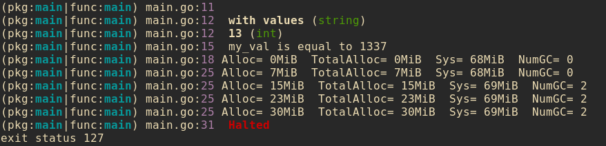

# dbg

Lightweight and easy-to-use embeddable debugger for Go.

`dbg` provides basic informations such as the position in the program, the caller function, the memory usage etc. with a colored output.



## Getting started

```
$ go get github.com/year-zero/dbg
```

## Usage

### Display infos at a given position

Adding `dbg.Point()` somewhere in your program will display some informations about the place:

<details><summary>Example</summary>
<p>
```go
func main() {
	dbg.Point()
}
```

Output:

```
(pkg:main|func:main) main.go:6
```
</p>
</details>

You can also give arguments to `Point()`, for example to display the content of an object. Its type will be shown next to its value.

<details><summary>Example</summary>
<p>

```go
func main() {
	myvar := 1337
	dbg.Point(myvar)
}
```

Output:

```
(pkg:main|func:main) main.go:7   1337 (int)
```
</p>
</details>

Another function, `dbg.Printf()` emulates the behavior of `fmt.Printf` but adds the debugger prefix:

<details><summary>Example</summary>
<p>

```go
func main() {
	name := "General Kenobi"
	dbg.Printf("hello there, %s\n", name)
}
```

Output:

```
(pkg:main|func:main) main.go:7   hello there, General Kenobi
```

</p>
</details>

### Display memory stats

`dbg.Mem()` allows you to see some memory informations. Its does not require any parameter.